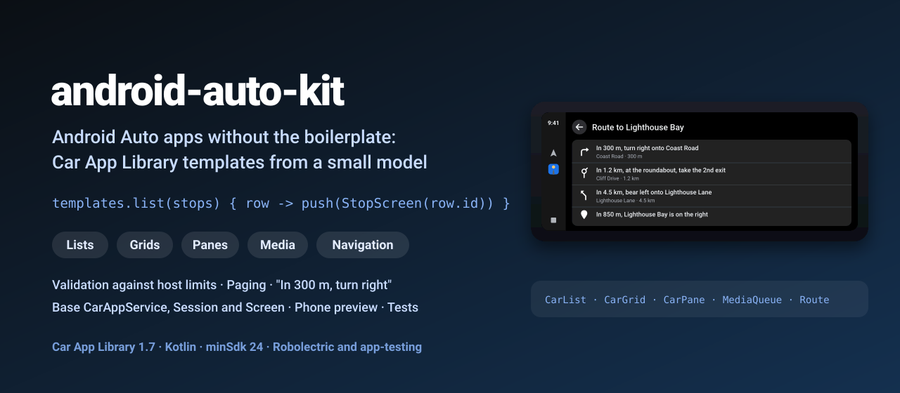
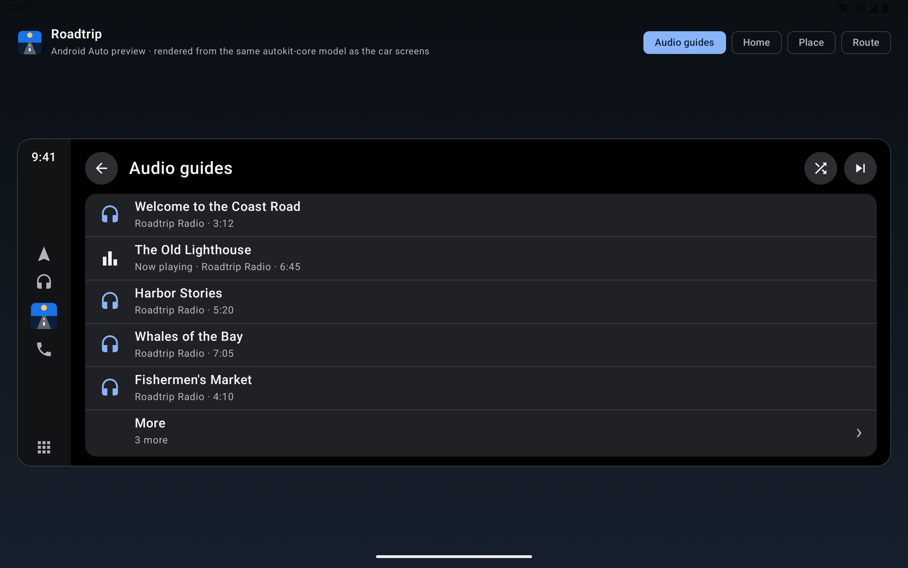
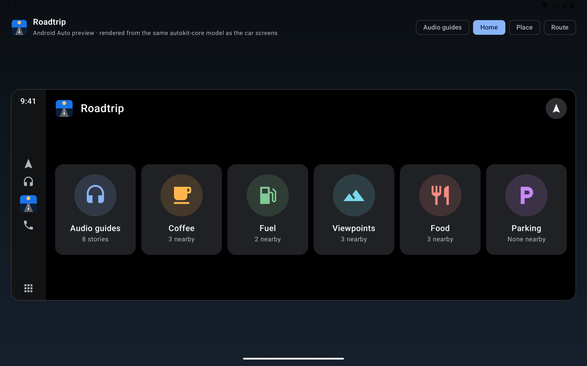
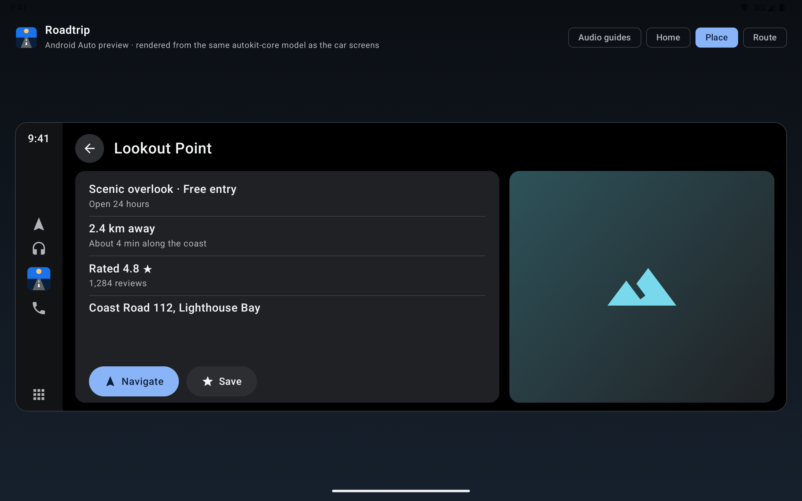
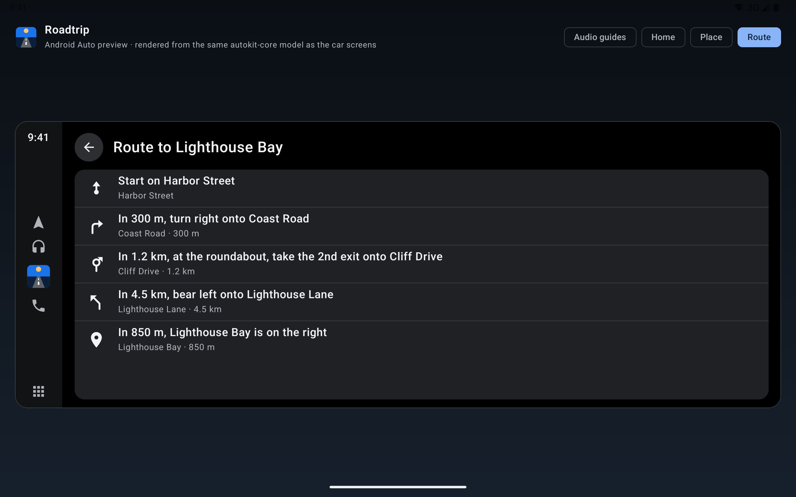

<p align="center">
  
</p>

<p align="center">
  <a href="https://github.com/halilozel1903/android-auto-kit/actions/workflows/ci.yml"></a>
  <a href="https://jitpack.io/#halilozel1903/android-auto-kit"></a>
  
  
  
  
  <a href="LICENSE"></a>
</p>

**android-auto-kit** removes the boilerplate from Android Auto apps built on the [Car App Library](https://developer.android.com/training/cars/apps). Describe a screen with a small Kotlin model (`CarList`, `CarGrid`, `CarPane`, `CarMessage`, `MediaQueue`, `Route`) and the kit builds the `ListTemplate`, `GridTemplate`, `PaneTemplate`, `MessageTemplate` or `NavigationTemplate` for you: checked against the host's limits, with the right header API for the car's API level, icons resolved and clicks wired. A base `KitCarAppService`, `KitSession` and `KitScreen` take care of host validation, the screen stack and errors. The model lives in a plain Kotlin module with unit tests, so the same screens can be tested on the JVM and drawn in a phone preview.

```kotlin
class RoadtripService : KitCarAppService() {
    override fun onCreateRootScreen(carContext: CarContext, intent: Intent): Screen = HomeScreen(carContext)
}

class HomeScreen(carContext: CarContext) : KitScreen(carContext) {
    override fun onCreateTemplate() = templates.grid(home, headerAction) { item ->
        push(CarListScreen(carContext, content = { places(item.id) }) { row -> push(PlaceScreen(carContext, row.id)) })
    }
}
```

## Screenshots

The sample app's phone preview, captured by CI on a landscape tablet emulator (Pixel Tablet, API 35). It draws the same `autokit-core` model the car screens use in a 1920 x 720 (8:3) car display. Android Auto itself renders the templates on the head unit, so test the real screens with the [Desktop Head Unit](#testing-with-the-desktop-head-unit).

| Media list (paged) | Grid |
| :---: | :---: |
|  |  |
| **Pane** | **Navigation list** |
|  |  |

## Why

The Car App Library is the way to build Android Auto apps outside media and messaging, but every app writes the same code: a `CarAppService` with a host validator that allows all hosts in debug builds, a `Session` that returns the first screen, `Row.Builder().setTitle(...).addText(...)` chains, items that crash the build when a grid tile has no image or a header action has no icon, lists that silently get cut at six rows, and since 1.7 a new `Header` API next to the deprecated `setTitle`/`setHeaderAction` that older cars still need. android-auto-kit wraps all of that in a few builders, and gives you the model to test it.

## Features

- **Declarative screens**: `CarList`, `CarGrid`, `CarPane` and `CarMessage` are plain data classes; `KitTemplates` turns them into Car App Library templates.
- **Validation with typed errors**: `list.validate(limits)` returns `ValidationError`s (`TooManyItems`, `TooManyActions`, `MissingActionIcon`, `MultiplePrimaryActions`, `TooManyRowTexts`, `TextTooLong`, `BlankText`, `DuplicateId`, `EmptyContent`, `InvalidValue`) with a path like `list.rows[7]`. Test your screens on the JVM before a car ever sees them.
- **Host limits**: the defaults match the Car App Library's fallbacks (6 list rows, 6 grid tiles, 4 pane rows, 2 actions); `KitScreen` reads the real limits from `ConstraintManager`.
- **Clip or fail**: by default content that doesn't fit is clipped (and logged) so a long server list never crashes the car screen; `strict = true` throws a `CarModelException` instead.
- **Paging**: `CarPaging.pages(...)` and `CarList.paged(maxItems)` split long lists into pages with a "More" row; `CarListScreen` pushes the next page for you.
- **One call for every car**: car API level 7+ gets the `Header` (start action, icon actions); older hosts get the deprecated title, header action and action strip. Primary actions and pane images are only sent where the host supports them.
- **Media queues**: an immutable `MediaQueue` with next/previous, repeat (off, one, all), shuffle that keeps the current item, play next, enqueue, remove and move, plus `templates.mediaQueue(queue, "Audio guides")` with a "Now playing" row.
- **Navigation**: `NavigationStep` and `Route` with English cues ("In 300 m, turn right onto Coast Road", "At the roundabout, take the 2nd exit"), distance rounding ("300 m", "1.2 km", "500 ft", "0.3 mi"), a route list for any app (`templates.route`) and `RoutingInfo`/`NavigationTemplate` builders for navigation apps. Maneuver arrows ship with the library.
- **Base classes**: `KitCarAppService` (host validation, session), `KitSession`, `KitScreen` (templates, back or app icon header action, `push`, `pushForResult`, `pop`, `popToRoot`, `popTo`, `replaceWith`, `finishWithResult`, `toast`, `refresh`, error template on exceptions) and ready-made `CarListScreen`, `CarGridScreen`, `CarPaneScreen`, `CarMessageScreen`.
- **Pure Kotlin core** (`android-auto-kit-core`): the model, validation, paging, media queue and formatting, with 51 unit tests that run on any JVM.

## Installation

Add JitPack to `settings.gradle.kts`:

```kotlin
dependencyResolutionManagement {
    repositories {
        google()
        mavenCentral()
        maven("https://jitpack.io")
    }
}
```

Then the dependency:

```kotlin
dependencies {
    implementation("com.github.halilozel1903.android-auto-kit:android-auto-kit:1.0.0")
    // Pure Kotlin model, validation, paging, media queue and formatting only (for JVM modules):
    // implementation("com.github.halilozel1903.android-auto-kit:android-auto-kit-core:1.0.0")

    testImplementation("androidx.car.app:app-testing:1.7.0")
}
```

The library brings `androidx.car.app:app` 1.7.0 as an `api` dependency and needs `minSdk` 23 or higher (the sample uses 24).

Declare the car app in your manifest. Pick the category that matches your app; the sample is a point of interest app:

```xml
<application ...>
    <meta-data
        android:name="com.google.android.gms.car.application"
        android:resource="@xml/automotive_app_desc" />
    <meta-data
        android:name="androidx.car.app.minCarApiLevel"
        android:value="1" />

    <service
        android:name=".RoadtripService"
        android:exported="true">
        <intent-filter>
            <action android:name="androidx.car.app.CarAppService" />
            <category android:name="androidx.car.app.category.POI" />
        </intent-filter>
    </service>
</application>
```

`res/xml/automotive_app_desc.xml`:

```xml
<automotiveApp>
    <uses name="template" />
</automotiveApp>
```

> The build is also set up for Maven Central (`io.github.halilozel1903:android-auto-kit`) via the vanniktech publish plugin.

## Usage

**Service and screens**

```kotlin
class RoadtripService : KitCarAppService() {
    // Debuggable builds allow every host (the Desktop Head Unit, emulators); release builds only
    // the known Android Auto and Automotive hosts. Override allowedHostsRes for your own list.
    override fun onCreateRootScreen(carContext: CarContext, intent: Intent): Screen = HomeScreen(carContext)
}

class HomeScreen(carContext: CarContext) : KitScreen(carContext) {
    override val imageResolver = ImageResolver.drawables(carContext, mapOf("coffee" to R.drawable.ic_coffee))

    override fun onCreateTemplate(): Template = templates.grid(
        grid = CarGrid(
            title = "Roadtrip",
            items = listOf(CarGridItem("coffee", "Coffee", CarImage("coffee", tint = 0xFFFFB74D.toInt()), "3 nearby")),
            actions = listOf(CarAction("route", "Route", CarImage("navigation"))),   // header actions need icons
        ),
        headerAction = headerAction,          // Action.APP_ICON on the root, Action.BACK below it
        onAction = { push(RouteScreen(carContext)) },
    ) { item -> push(PlacesScreen(carContext, item.id)) }
}
```

**Lists, panes and messages**

```kotlin
templates.list(
    CarList(
        title = "Coffee",
        rows = places.map { CarRow(it.id, it.name, texts = listOf("${DistanceFormat.text(it.meters)} · ${it.rating} ★"), browsable = true) },
        emptyMessage = "Nothing nearby",
    ),
    headerAction,
) { row -> push(PlaceScreen(carContext, row.id)) }

templates.pane(
    CarPane(
        title = "Lookout Point",
        rows = listOf(CarRow("hours", "Scenic overlook", texts = listOf("Open 24 hours"))),
        actions = listOf(CarAction("navigate", "Navigate", primary = true), CarAction("save", "Save")),
        image = CarImage("landscape"),
    ),
    headerAction,
) { action -> if (action.id == "navigate") push(RouteScreen(carContext)) }

templates.message(CarMessage("Parking", "No free parking within 5 km.", actions = listOf(CarAction("back", "Back")))) { pop() }
```

Or skip the screen class:

```kotlin
push(CarListScreen(carContext, content = { stops.toCarList() }) { row -> push(StopScreen(carContext, row.id)) })
// Longer than the host allows? The last row becomes "More" and opens the next page.
```

**Media queue**

```kotlin
var queue = MediaQueue(guides).skipTo("lighthouse").withRepeat(RepeatMode.ALL)

templates.mediaQueue(queue, "Audio guides") { item ->
    queue = queue.skipTo(item.id)
    refresh()
}

queue.next()                     // the next item in play order
queue.withShuffle(true)          // current item stays first, the rest is shuffled
queue.upNext(3)                  // the next three items
MediaFormat.duration(405_000)    // "6:45"
```

**Routes and navigation**

```kotlin
val route = Route(
    destination = "Lighthouse Bay",
    steps = listOf(
        NavigationStep(ManeuverType.DEPART, 0.0, "Harbor Street"),
        NavigationStep(ManeuverType.TURN_RIGHT, 300.0, "Coast Road"),
        NavigationStep(ManeuverType.ROUNDABOUT, 1_200.0, "Cliff Drive", roundaboutExit = 2),
        NavigationStep(ManeuverType.DESTINATION_RIGHT, 850.0, "Lighthouse Bay"),
    ),
)

ManeuverFormat.English.cue(route.steps[1])                   // "In 300 m, turn right onto Coast Road"
DistanceFormat.text(1_234.0)                                 // "1.2 km"
DistanceFormat.text(1_931.0, DistanceUnits.IMPERIAL)         // "1.2 mi"

templates.route(route) { index -> toast(ManeuverFormat.English.instruction(route.steps[index])) }   // any app

// Navigation apps (category NAVIGATION, NAVIGATION_TEMPLATES permission, drawing their own map):
templates.navigation(route, stepIndex = 1, actionStrip = stopStrip, metersToStep = 120.0, remainingSeconds = 540)
```

**Validation and tests**

```kotlin
val result = list.validate(CarLimits.Default)
result.errors   // [TooManyItems(path=list.rows, count=8, max=6)]
result.orThrow()

list.clippedTo(limits)       // drop extra rows and actions, ellipsize long text
list.paged(maxItems = 6)     // pages with "More" rows
```

```kotlin
@RunWith(RobolectricTestRunner::class)
class HomeScreenTest {
    private val carContext = TestCarContext.createCarContext(RuntimeEnvironment.getApplication())

    @Test
    fun showsSixCategories() {
        val template = HomeScreen(carContext).onGetTemplate() as GridTemplate
        assertEquals(6, template.singleList?.items?.size)
    }
}
```

## Testing with the Desktop Head Unit

The phone preview is for development and screenshots; the real templates run on the head unit. To try the sample (or your app) with the Desktop Head Unit (DHU):

1. Install the DHU: Android Studio > SDK Manager > SDK Tools > **Android Auto Desktop Head Unit Emulator**.
2. On the phone (or emulator with Google Play), install Android Auto, open its settings, tap the version number ten times to enable developer mode, then choose **Start head unit server** from the overflow menu. Enable **Unknown sources** in the developer settings so a debug build shows up.
3. Install the sample: `./gradlew :sample:installDebug`.
4. Forward the port and start the DHU:

   ```bash
   adb forward tcp:5277 tcp:5277
   $ANDROID_SDK_ROOT/extras/google/auto/desktop-head-unit
   ```

5. Open the launcher on the DHU and pick **Roadtrip**. Debug builds of `KitCarAppService` accept any host, so no allowlist is needed.

See the official guide, [Test Android apps for cars](https://developer.android.com/training/cars/testing/dhu), for details.

## API

| Android (`autokit`) | What it does |
| --- | --- |
| `KitCarAppService` | `CarAppService` with debug allow-all host validation and a `KitSession`; implement `onCreateRootScreen` |
| `KitSession(rootScreen)` | Session that shows the root screen; subclass for deep links |
| `KitScreen` | `templates`, `limits`, `carApiLevel`, `headerAction`, `push`, `pushForResult`, `pop`, `popToRoot`, `popTo`, `replaceWith`, `finishWithResult`, `toast`, `refresh`, `onTemplateError` |
| `CarListScreen` / `CarGridScreen` / `CarPaneScreen` / `CarMessageScreen` | Screens from a model lambda, without a class (lists are paged) |
| `KitTemplates(context, carApiLevel, images, limits, strict)` | `list`, `grid`, `pane`, `message`, `error`, `loading`, `mediaQueue`, `route`, `row`, `header`, `actionStrip`, `bodyAction` |
| `KitTemplates.navigation / routingInfo / step / maneuver` | `NavigationTemplate`, `RoutingInfo`, `Step` and `Maneuver` for navigation apps |
| `ImageResolver.drawables(context, map)` / `builtIn(context)` / `then` | `CarImage` names to `CarIcon`s, with tint |
| `KitIcons` | Built-in maneuver arrows and the now playing icon |
| `FormattedDistance.toCarDistance()` / `ManeuverType.toCarManeuverType()` | Core values to Car App Library types |

| Core (`autokit-core`) | What it does |
| --- | --- |
| `CarList`, `CarRow`, `CarGrid`, `CarGridItem`, `CarPane`, `CarMessage`, `CarAction`, `CarImage` | The screen model |
| `validate(limits)` / `clippedTo(limits)` / `CarLimits` | Typed `ValidationError`s, clipping, host limits |
| `CarPaging.chunk / pages / pageIndexOf / nextPageFor`, `CarList.paged` | Paging with "More" rows |
| `MediaQueue`, `MediaItem`, `RepeatMode`, `MediaFormat` | Play queue logic and formatting |
| `Route`, `NavigationStep`, `ManeuverType`, `ManeuverFormat`, `DistanceFormat` | Routes, cues and distances |

## Sample app

The `sample` module is **Roadtrip**, a fictional point of interest app for a coastal drive:

- **Home**: a grid of categories with a route action in the header (`GridTemplate`).
- **Audio guides**: a media queue as a paged list; tap a guide to play it, shuffle and next in the header (`ListTemplate`).
- **Coffee, Fuel, Viewpoints, Food**: places as lists built with `CarListScreen`, opening a place pane with Navigate and Save (`PaneTemplate`).
- **Parking**: an empty state (`MessageTemplate`).
- **Route**: the steps to Lighthouse Bay with maneuver arrows (a navigation style `ListTemplate`, since POI apps can't use `NavigationTemplate`).

Its launcher activity is a Compose preview of the same model. Taps can't be timed reliably through adb, so it opens a screen from an intent extra (used by `scripts/screenshots.sh`):

```bash
./gradlew :sample:installDebug
adb shell am start -n io.github.halilozel1903.autokit.sample/.preview.PreviewActivity --es scene list
```

`scene` is one of `list`, `grid`, `pane` or `navigation`.

## Project structure

| Module | What it is |
| --- | --- |
| `autokit-core` | Pure Kotlin: screen model, validation, paging, media queue, maneuver and distance formatting. Published as `android-auto-kit-core` |
| `autokit` | Car App Library: `KitTemplates`, `KitCarAppService`, `KitSession`, `KitScreen`, model screens, navigation builders, maneuver icons. Robolectric tests with `app-testing`. Published as `android-auto-kit` |
| `sample` | Roadtrip: the car app plus the Compose phone preview and screenshot scenes |

## Tech stack

Kotlin 2.4 · AGP 9.4 with built-in Kotlin · Gradle 9.6 · Car App Library 1.7 (`androidx.car.app:app`, `app-testing`) · Robolectric · Jetpack Compose (BOM 2026.09, Material 3) for the preview · GitHub Actions with a tablet emulator

## License

MIT. See [LICENSE](LICENSE).
